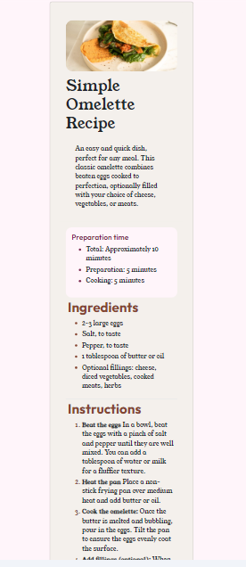

# Frontend Mentor - Recipe page solution

This is a solution to the [Recipe page challenge on Frontend Mentor](https://www.frontendmentor.io/challenges/recipe-page-KiTsR8QQKm). Frontend Mentor challenges help you improve your coding skills by building realistic projects. 

## Table of contents

- [Overview](#overview)
  - [The challenge](#the-challenge)
  - [Screenshot](#screenshot)
  - [Links](#links)
- [My process](#my-process)
  - [Built with](#built-with)
  - [What I learned](#what-i-learned)
  - [Continued development](#continued-development)
  - [Useful resources](#useful-resources)
- [Author](#author)

## Overview

### Screenshot

### Links

- Solution URL: [Github](https://github.com/cmb347827/recipe-page-main)
- Live Site URL: [Live Github](https://cmb347827.github.io/recipe-page-main/)

## My process

### Built with

- Semantic HTML5 markup
- Sass/SCSS
- Bootstrap
- Mobile-first workflow

### What I learned

- I could use either the img element and the srcset attribute for the image, but I went with just the img element and the Bootstrap class img-fluid.

- I could have used Boostrap card classes for the entire page, meaning including the lists. But I opeted not to use the Boostrap classes  list-group and list-group-item for better visual look that matches the design.

- I found a helpful site to help calculate image aspect-ratio 

- And I discovered the use of ul::mark to make it easier to style list-style bullets.

- First time use of `text-wrap:balance;` for headings to make them distribute wording more evenly 

### Continued development

- Daily tutorials and projects in HTML5, CSS3, Javascript, Bootstrap, Sass/SCSS. For now, in time I will go re-learn React ect.

### Useful resources

[ratio buddy](https://ratiobuddy.com/)

## Author

- Website - [One of my latest codepens](https://codepen.io/cynthiab72/pen/oNybYON)
- Frontend Mentor - [@cmb347827](https://www.frontendmentor.io/profile/cmb347827)

